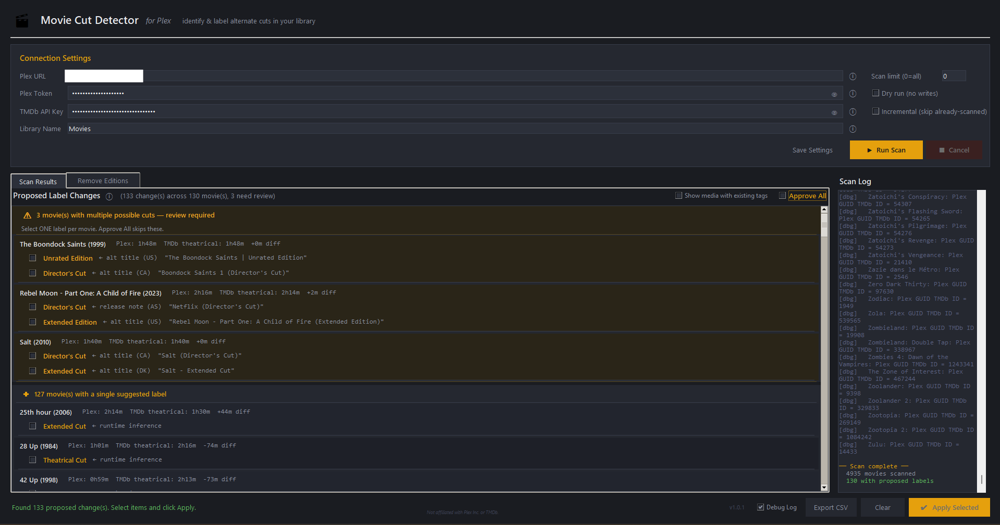
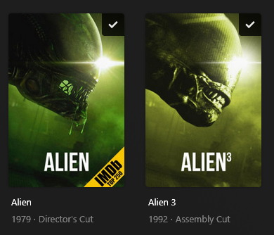
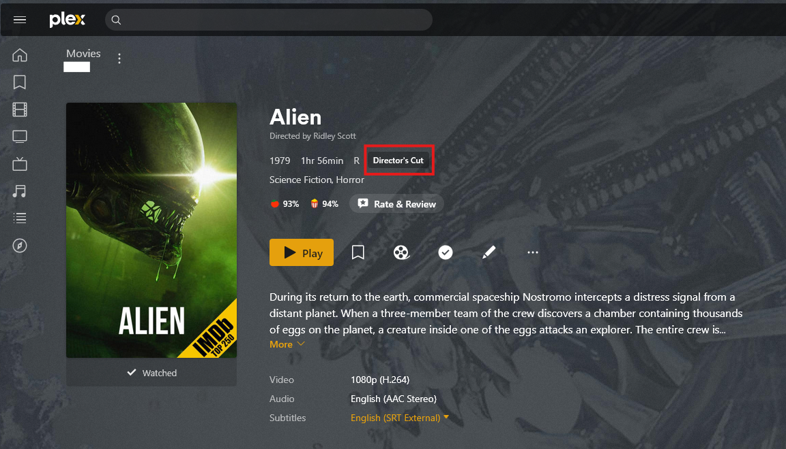
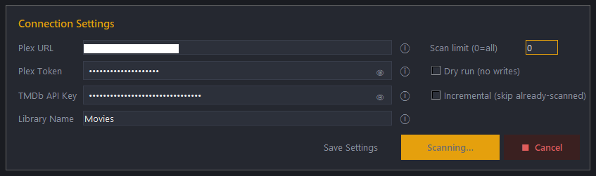
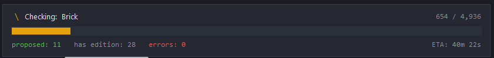
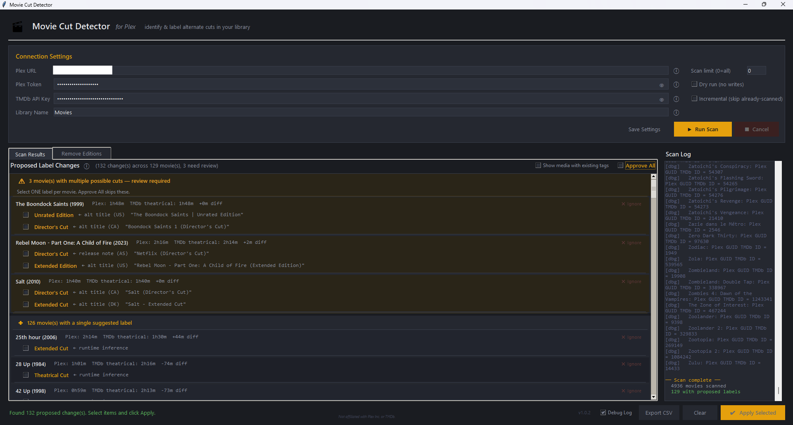
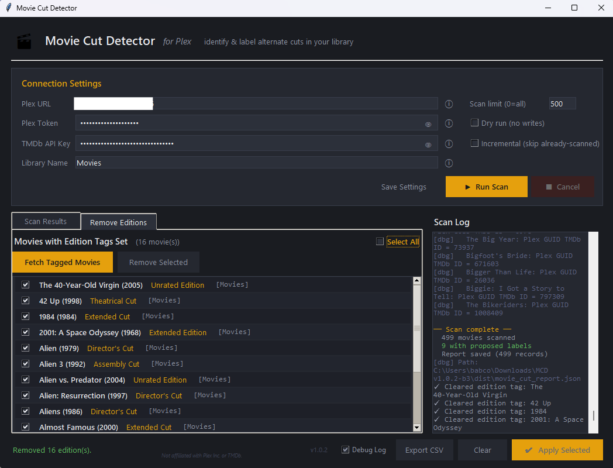
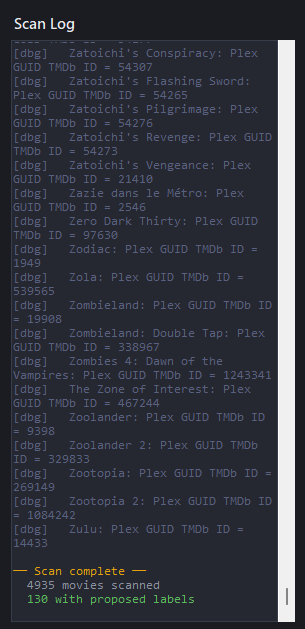

# Movie Cut Detector — for Plex

### Identify and label alternate cuts of films in your Plex library — no filename editing required.

**v1.0.2** · Python 3.10+ · Windows GUI + Cross-platform CLI · MIT License

---

## What it does

Movie Cut Detector scans your Plex movie library, cross-references each film against [The Movie Database (TMDb)](https://www.themoviedb.org/), and identifies movies where your file's runtime suggests you have a Director's Cut, Extended Edition, Unrated Cut, or other alternate edit — not the standard theatrical release.

When it finds a match, it writes that directly to Plex's built-in `editionTitle` metadata field — the same field that displays as the edition badge on movie posters in Plex Web and Plex apps:

No file renaming. No YAML configuration. No Docker containers. Connect, scan, review, apply.


*The main scan results interface after scanning a library of 4,900+ movies.*

---

## Who this is for

If you have a library full of movies you know include extended cuts, director's cuts, and unrated versions — but you never went back and added `{edition-Director's Cut}` to the filenames — this tool is for you.

Many Plex users don't rename their files with inline edition tags, or at least started their server that way. This leaves potentially hundreds of unlabeled, alternate cuts of movies on Plex. If your copy of *Aliens* is called `Aliens.1986.BluRay.mkv` and it's 17 minutes longer than the theatrical cut, Plex has no idea it's the Director's Cut and shows nothing. Movie Cut Detector figures that out for you, using the runtime data and release metadata TMDb already has.

---

## How it's different from Edition Manager

There are excellent tools in this space and it's worth being clear about what each one does.

**[Edition Manager for Plex](https://github.com/x1ao4/plex-edition-manager)**, **[Edition Manager](https://github.com/Entree3k/edition-manager)**, and similar tools write technical metadata — resolution, codec, HDR format, content rating, bitrate — into the edition field. They're ideal for people who want their library to display something like:

```
2160p · Dolby Vision · TrueHD Atmos · REMUX
```

Those tools read technical file properties and Plex database info. They don't try to identify *which cut of the film* you have unless the data already exists in the filename or the file metadata — something like `Aliens.1986.{edition-Director's Cut}.mkv`.

**Movie Cut Detector is different.** It ignores technical file properties entirely and focuses on one question: *is this the theatrical cut, or is it something else?*

It works on files named anything — `movie.mkv`, `Aliens.1986.BluRay.mkv`, or otherwise. If your file is 17 minutes longer than the theatrical cut and TMDb's release notes reference a "Director's Cut," it'll propose that label.

| | Movie Cut Detector | Edition Manager |
|---|---|---|
| **Purpose** | Identify which *cut* of a film you have | Display technical specs of your file |
| **Data source** | TMDb runtime + release metadata | File metadata, Plex database |
| **Requires filename tags** | No | Recommended for best results |
| **What it writes** | `Director's Cut`, `Extended Edition`, etc. | `2160p · DV · TrueHD`, etc. |
| **Review before applying** | Yes — full interactive UI | Automated |
| **Undo support** | Yes — Remove Editions tab | Reset command |

They're complementary, not competing. You can run both — Movie Cut Detector to identify cuts, Edition Manager if you also want technical specs.



*The edition badge as it appears on a movie poster in Plex Web after applying a label.*


*The edition badge as it appears on a movie's information page.*

---

## Features

- **Windows GUI** with a dark Plex-inspired interface — no terminal required for everyday use
- **Cross-platform CLI** for Linux, macOS, and Windows PowerShell — scriptable and automatable
- **Plex GUID matching** — uses the TMDb ID Plex already has stored, not a text search, so *The Lion King (2019)* never accidentally matches the 1994 original
- **Two-stage detection** — runtime comparison + TMDb metadata scan (release notes, alternative titles)
- **Interactive review** — all proposed changes shown before anything is written; approve all, select individually, or skip specific items
- **Multi-option handling** — when TMDb returns more than one possible cut label, those movies are separated out for manual review; only one label can be selected per film
- **Existing edition detection** — movies already having an `editionTitle` set are hidden by default to prevent accidental overwrites, with a toggle to review and update them
- **Remove Editions tab** — review and clear edition tags you've previously applied
- **Export CSV** — full spreadsheet of scan results for auditing or sharing
- **Incremental scanning** — after an initial full scan, subsequent runs only process new additions to your library
- **Ignore list** — permanently hide specific movies from results; stored in `movie_cut_ignore.json` and reversible at any time
- **Live scan stats** — real-time counters for proposed changes, existing editions, and errors
- **ETA** — rolling estimated time remaining, recalibrates as the scan progresses
- **Debug log** — step-by-step connection and lookup output, always available during any operation
- **Dry run mode** — simulate everything without writing anything to Plex

---

## Requirements

- **Python 3.10 or newer**
  Download from https://python.org — on Windows, check "Add Python to PATH" during install
- A **Plex Media Server** (local or remote)
- A free **TMDb API key** — takes about 2 minutes to get (see below)

---

## Installation

### Step 1 — Install dependencies

```bash
pip install plexapi requests python-dotenv colorama
```

For building the Windows `.exe`, also install:
```bash
pip install pyinstaller
```

### Step 2 — Get your credentials

**Plex Token**
1. Sign in to Plex Web App in your browser
2. Browse to any movie in your library
3. Click the three-dot menu `...` on that movie → **Get Info**
4. In the Get Info panel, click **View XML**
5. A new browser tab opens — look in the URL bar for `?X-Plex-Token=XXXXXXXXXX`
6. Copy the value after the `=` sign

Full guide with screenshots: https://support.plex.tv/articles/204059436

**TMDb API Key**
1. Create a free account at https://www.themoviedb.org/signup
2. Go to **Settings → API**
3. Request an API key (choose Developer)
4. Copy the **API Key (v3 auth)** value

### Step 3 — Configure credentials

Create a file named `.env` in the same folder as the scripts:

```
PLEX_URL=http://localhost:32400
PLEX_TOKEN=your_token_here
TMDB_API_KEY=your_tmdb_key_here
```

**Finding your Plex URL:**

| Scenario | URL format |
|---|---|
| Local — same network as server | `http://localhost:32400` or `http://192.168.x.x:32400` |
| Remote — different network | Check Plex Web → Settings → Remote Access for your public IP and port |

> The GUI saves credentials automatically to `.env` when you click Save Settings — you only need to create this file manually for the CLI.

---

## Running the GUI (Windows)

```bash
python movie_cut_detector_gui.py
```

Both `movie_cut_detector.py` and `movie_cut_detector_gui.py` must be in the same folder.

**Or build a standalone `.exe` (no Python required):**

1. Double-click `build.bat`
2. Wait ~60 seconds
3. Find `MovieCutDetector.exe` in the `dist\` folder
4. Copy it anywhere — no Python installation needed on the end user's machine

### GUI walkthrough

**Connection Settings**



Fill in your Plex URL, Token, TMDb API Key, and Library Name. Click `ⓘ` next to any field for detailed help. Click **Save Settings** to persist credentials to `.env`.

**Running a scan**



Click **▶ Run Scan**. The status panel shows the current movie being checked, a `47 / 4,933` counter, a live ETA, and running totals for proposed changes, existing editions, and errors. Click **■ Cancel** at any time — partial results are preserved.

**Reviewing results — Scan Results tab**



- **Multi-option movies** (amber section, top): TMDb found more than one possible cut. Select exactly one per movie — checkboxes are mutually exclusive.
- **Single-option movies** (orange section): one clear suggestion. **Approve All** checks all of these at once and skips multi-option movies.
- **Show media with existing tags**: reveals movies already having an `editionTitle` set in Plex — hidden by default.
- **Click any movie title to open a Google search** for that film's edition runtimes.
- `✕ Ignore` on any row adds that movie to the ignore list — it won't appear in future scans.

**Reading the runtime columns**

| Column | Meaning |
|---|---|
| `Plex: Xh XXm` | Actual duration of your file |
| `TMDb theatrical: Xh XXm` | Standard theatrical runtime from TMDb |
| `+Xm diff` | Your file is longer — likely an extended or director's cut |
| `-Xm diff` | Your file is shorter — likely a theatrical or TV cut |
| `0m diff` | Matches theatrical, but TMDb metadata flagged a known alternate cut |

**Remove Editions tab**



Click **Fetch Tagged Movies** to load all movies from the saved scan report that have an `editionTitle` set. Check the ones you want to clear, then click **Remove Selected**. Respects the Dry Run checkbox. All activity is logged in the Debug Log panel, which opens automatically.

**Exporting results**
Click **Export CSV** in the bottom bar to save a spreadsheet with title, year, runtimes, suggested label, TMDb source, existing edition, and match status for every scanned movie.

**Applying changes**
Check the boxes for the changes you want, click **✔ Apply Selected**, confirm the dialog. The `editionTitle` field is written to Plex immediately and the scan report is updated.

**Debug Log**



Check **Debug Log** in the bottom bar to open the log panel on the right side. Shows step-by-step connection status, HTTP responses, TMDb lookup results, and file write confirmations. Useful for diagnosing any connection or apply issues.

---

## Running the CLI

```bash
python movie_cut_detector.py
```

### Options

| Flag | Description |
|---|---|
| `--library "Movies"` | Plex library section name (default: Movies) |
| `--limit 20` | Only scan the first N movies — useful for testing |
| `--dry-run` | Show all proposed changes but write nothing to Plex |
| `--no-labels` | Report only — skip the interactive apply stage |
| `--incremental` | Skip movies already in `movie_cut_report.json` |

### Examples

```bash
# Safe first run — test on 20 movies, write nothing
python movie_cut_detector.py --limit 20 --dry-run

# Full scan
python movie_cut_detector.py

# Scan a different library
python movie_cut_detector.py --library "4K Movies"

# Only scan new movies added since last run
python movie_cut_detector.py --incremental

# Report only, no prompts
python movie_cut_detector.py --no-labels
```

### Output

After each run, `movie_cut_report.json` is saved next to the script. It contains the full scan data for every movie — TMDb IDs, runtimes, proposed labels, and flags. This file is used by the incremental scan feature and the Remove Editions tab.

---

## How detection works

**Stage 1 — Runtime comparison**
Your file's duration is compared to TMDb's theatrical runtime. A difference of 8+ minutes flags the movie for review. 15+ minutes is a strong signal. A large positive difference suggests an extended or director's cut; a large negative difference suggests a theatrical or TV edit.

**Stage 2 — Metadata scan**
TMDb's release date notes and alternative titles are scanned for known cut keywords. The label preserves whichever word — "Cut" or "Edition" — appears in the TMDb source text, so "Extended Edition" stays "Extended Edition."

**TMDb ID accuracy**
Movie matching uses the TMDb ID that Plex already has stored in `movie.guids` — not a title search. This means *The Lion King (2019)* always matches the 2019 live-action film, never the 1994 original. A text search is only used as a fallback for movies Plex couldn't auto-match.

### Recognized cut labels

| Label | Triggered by |
|---|---|
| Director's Cut | "director's cut", "director cut" |
| Extended Cut / Extended Edition | "extended cut", "extended edition" |
| Unrated Cut / Unrated Edition | "unrated cut", "unrated edition", "unrated" |
| Theatrical Cut | "theatrical cut", "theatrical version" |
| Final Cut | "final cut" |
| Ultimate Cut / Ultimate Edition | "ultimate cut", "ultimate edition" |
| Redux | "redux" |
| Workprint | "workprint", "work print" |
| Complete Cut | "complete cut" |
| Assembly Cut | "assembly cut" |
| Producer's Cut | "producer's cut", "producer cut" |
| Television Cut | "television cut", "tv cut", "broadcast cut" |

**Intentionally excluded:** International Cut, Special Edition, Remastered — these appear too broadly in TMDb metadata (film festival screenings, Blu-ray marketing) and rarely indicate a genuinely different edit of the film.

---

## Files

| File | Purpose |
|---|---|
| `movie_cut_detector.py` | CLI script — cross-platform |
| `movie_cut_detector_gui.py` | Windows GUI source |
| `build.bat` | One-click `.exe` builder (Windows) |
| `movie_cut_report.json` | Saved scan report — auto-generated |
| `movie_cut_ignore.json` | Persistent ignore list — auto-generated |
| `.env` | Your credentials — auto-generated on first GUI run |

---

## Tips

- **Always run with `--dry-run` first** on a new installation to see what would change before committing.
- The scan is completely read-only until you click **Apply Selected** or confirm in the CLI. Nothing is written during scanning.
- For large libraries (1,000+ movies), the ETA counter stabilizes after the first 100 movies and becomes a reliable estimate.
- If you have separate libraries ("Movies" and "4K Movies"), run the tool once per library.
- Click any movie title in the results list to open a Google search for that film's edition runtimes — useful for manually verifying a suggestion before approving it.
- Use `--incremental` for routine maintenance after your initial full scan. Only newly added movies will be checked, and results are merged into the existing report.
- The ignore list (`movie_cut_ignore.json`) is a plain JSON file. To un-ignore a movie, open it in any text editor and remove the GUID entry.

---

## Troubleshooting

**"Could not reach Plex server"**
- Verify the URL and port are correct
- For remote servers, confirm port forwarding is configured on your router
- Test by opening `http://YOUR_URL/identity` in a browser — if it returns XML, the URL is correct

**"Authentication failed (HTTP 401)"**
- Your Plex Token is wrong or expired — follow the token instructions above to get a fresh one

**"Library not found"**
- Library names are case-sensitive — check it exactly as it appears in the Plex sidebar
- The error message will list all available library names on your server

**A movie matched the wrong TMDb entry**
- This should be rare since the tool uses Plex's stored TMDb ID
- If it happens, fix the Plex match first (right-click the movie → Fix Incorrect Match), then re-scan

**Edition tag not showing in Plex after applying**
- Try refreshing metadata for that movie in Plex (right-click → Refresh Metadata)
- `editionTitle` requires Plex Pass on the server — on free servers the tool falls back to a label tag

---

## Disclaimer & License

This tool is not affiliated with or endorsed by Plex Inc. or The Movie Database (TMDb).

Use at your own risk. Always use Dry Run first on a new installation.

MIT License — see `LICENSE` for details.
